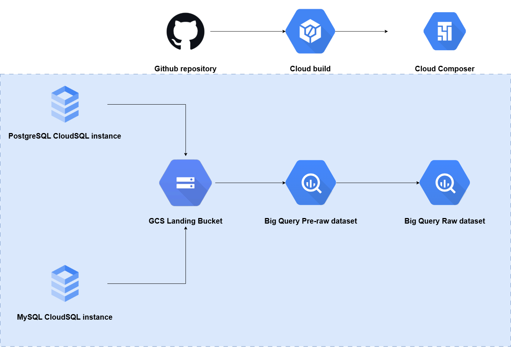
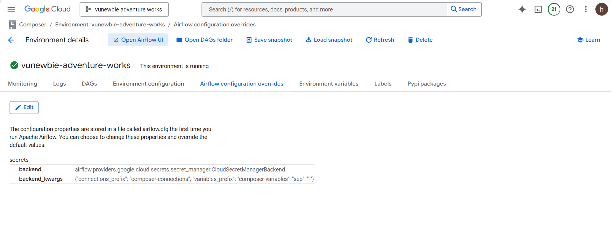
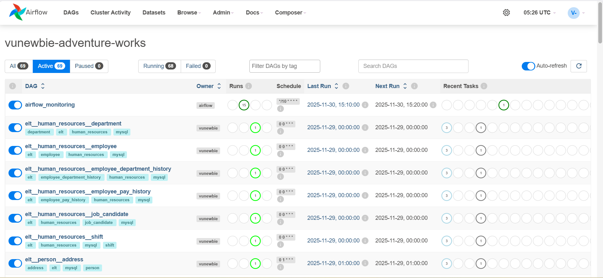

# Adventure Works Composer - ELT Pipeline

## Overview

This is the first part of a data engineering project implementing an ELT (Extract, Load, Transform) pipeline. The project architecture is inspired by the Medallion Architecture pattern, but has been modified to suit specific requirements.

This repository is responsible for generating data sources, extracting data from source databases into a landing layer, and then loading data into two layers:
- **Pre-Raw Layer** (`dataset__pre_raw`): Uses write-append operations
- **Raw Layer** (`raw__*`): Uses merge operations, serving as the raw layer in Medallion Architecture

The second part of this project focuses on data transformation using GCP Dataform (a tool similar to DBT).

## Architecture



This project uses the classic Adventure Works dataset from Microsoft ([learn more](https://learn.microsoft.com/en-us/sql/samples/adventureworks-install-configure?view=sql-server-ver17&tabs=ssms)). Although the original dataset is provided as a `.bak` file (SQL Server backup format), it only supports SQL Server. Therefore, the dataset has been exported to CSV files located in `init/data`.

### Development Environment

In the development environment, a local Airflow instance is created. The Docker files and code in `init/scripts` serve to simulate data sources for two database instances:
- MySQL instance
- PostgreSQL instance

### Production Environment

In the production environment, two CloudSQL instances are created. All scripts for creating tables and inserting data are located in the `gcp_data_source` folder.

The CI/CD process is implemented using Cloud Build, which automatically pulls code from this repository whenever a pull request is merged into the `main` branch and executes the deployment.

### Data Flow

1. **Extraction**: Airflow/Composer extracts data from source databases and uploads it to a GCS bucket, which serves as the staging/landing layer.
2. **Pre-Raw Layer**: Data is written (write-append) into the `pre-raw` dataset.
3. **Raw Layer**: Data is merged into the `raw` dataset.

These two layers (pre-raw and raw) represent a variation of the bronze layer when applying the Medallion Architecture pattern.

## Setup

### Airflow Connections

This project requires the following Airflow Connections to be configured:

#### MySQL Connections

1. **`person`** - Connection to MySQL database for `person` schema
   - **Connection Type**: MySQL
   - **Host**: MySQL server hostname or IP
   - **Schema**: `person`
   - **Login**: MySQL username
   - **Password**: MySQL password
   - **Port**: 3306 (default)

2. **`human_resources`** - Connection to MySQL database for `human_resources` schema
   - **Connection Type**: MySQL
   - **Host**: MySQL server hostname or IP
   - **Schema**: `human_resources`
   - **Login**: MySQL username
   - **Password**: MySQL password
   - **Port**: 3306 (default)

#### PostgreSQL Connections

1. **`sales`** - Connection to PostgreSQL database for `sales` schema
   - **Connection Type**: Postgres
   - **Host**: PostgreSQL server hostname or IP
   - **Schema**: `sales`
   - **Login**: PostgreSQL username
   - **Password**: PostgreSQL password
   - **Port**: 5432 (default)

2. **`production`** - Connection to PostgreSQL database for `production` schema
   - **Connection Type**: Postgres
   - **Host**: PostgreSQL server hostname or IP
   - **Schema**: `production`
   - **Login**: PostgreSQL username
   - **Password**: PostgreSQL password
   - **Port**: 5432 (default)

3. **`purchasing`** - Connection to PostgreSQL database for `purchasing` schema
   - **Connection Type**: Postgres
   - **Host**: PostgreSQL server hostname or IP
   - **Schema**: `purchasing`
   - **Login**: PostgreSQL username
   - **Password**: PostgreSQL password
   - **Port**: 5432 (default)

#### GCP Connection

1. **`gcp`** - Connection to Google Cloud Platform (used for GCS and BigQuery operations)
   - **Connection Type**: Google Cloud
   - **Project Id**: Your GCP project ID (e.g., `vunewbie-adventure-works`)
   - **Keyfile JSON**: Path to your GCP service account JSON key file, or paste the JSON content directly
   - **Scopes**: `https://www.googleapis.com/auth/cloud-platform` (default)
```

### Airflow Variables

Airflow Variables are automatically created and managed by the DAGs during execution. You do not need to create them manually. The following variables are created per DAG:

- **`{dag_id}_last_extraction`**: Stores the last extraction timestamp for incremental loading
  - Format: `YYYY-MM-DD HH:MM:SS`
  - Example: `elt__person__address_last_extraction`
  - Initial value: Set to 1 day ago on first run, then updated after each successful extraction

- **`{dag_id}_tempo_empty`**: Temporary flag indicating whether data was extracted in the current run
  - Values: `"True"` or `"False"`
  - Example: `elt__person__address_tempo_empty`
  - Used internally to skip merge task if no data was extracted

- **`{dag_id}_is_inited`**: Flag indicating whether the raw dataset and table have been initialized
  - Values: `"True"` or `None`
  - Example: `elt__person__address_is_inited`
  - Set to `"True"` after the first successful initialization of the raw layer

Where `{dag_id}` follows the pattern: `elt__{schema_name}__{table_name}`

For example, for the `person.address` table:
- DAG ID: `elt__person__address`
- Variables:
  - `elt__person__address_last_extraction`
  - `elt__person__address_tempo_empty`
  - `elt__person__address_is_inited`
```
### Examples
- Airflow configuration overrides:

- Secret managers

- Cloud build for CI/CD:

- Dags generated:

- GCS Bucket:


